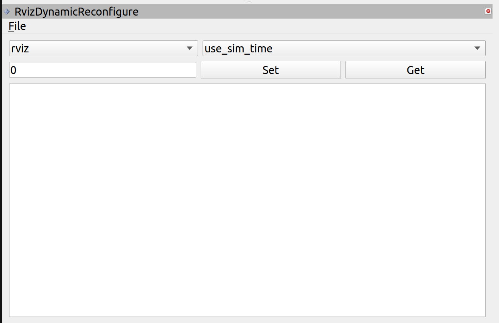

# Rviz Dynamic Reconfigure

    

## Overview
Rviz Dynamic Reconfigure is a ROS2 plugin that integrates with RViz2 to provide a GUI-based interface for dynamically reconfiguring ROS2 node parameters. This tool allows users to list available nodes, inspect configurable parameters, and modify their values in real-time without restarting the nodes.

## Features
- **Dynamic Parameter Configuration**: Modify ROS2 node parameters through an intuitive UI.
- **Node & Parameter Listing**: Automatically fetch and display available nodes and their parameters.
- **Logging & Diagnostics**: Provides real-time logging and diagnostics through a built-in log viewer.
- **Keyboard Shortcuts**: Easily search and filter nodes and parameters using shortcuts.
- **Threaded Execution**: Ensures smooth updates using a separate execution thread.

## GUI Overview


## Components
This package consists of several key components:

| Component            | Description |
|---------------------|-------------|
| `RvizDynamicReconfigure` | The main plugin class that integrates with RViz2, providing the graphical interface and core functionality for dynamic reconfiguration. |
| `DiagnosticsLogger`  | Handles logging and displays messages within the GUI to provide real-time feedback on parameter updates and errors. |
| `ServiceWrapper`    | Interacts with ROS2 services to request and modify parameters dynamically, handling communication between the GUI and ROS2 nodes. |
| `WatchdogTimer`     | Monitors system execution and ensures that parameter updates and requests do not hang indefinitely. |

## Installation & Usage
### Prerequisites
- ROS2 (Humble or newer recommended)
- RViz2

### Build Instructions
```sh
colcon build --packages-select rviz_dynamic_reconfigure
source install/setup.bash
```

### Running the Plugin
Launch RViz2 and add the `RvizDynamicReconfigure` panel from the available plugins list.

## Maintainers
- **Jesal Shah** - [shahjesal1510@gmail.com](mailto:shahjesal1510@gmail.com)

## License
This project is licensed under the [MIT License](LICENSE).